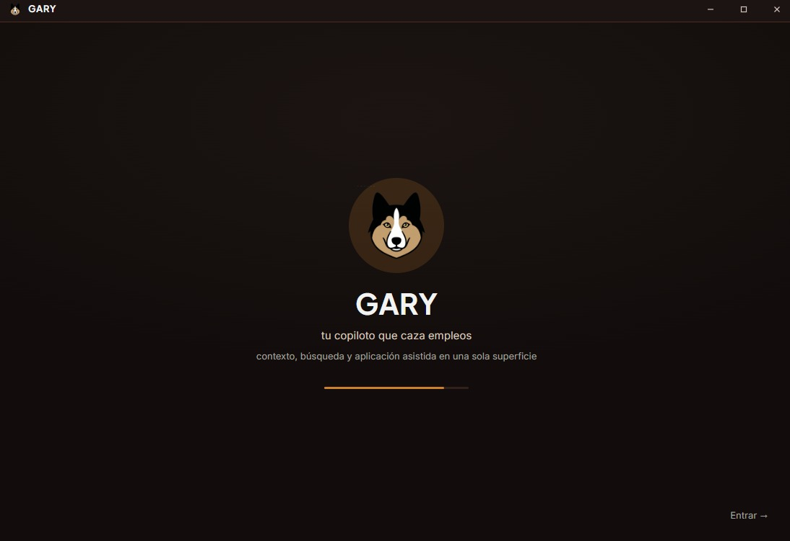

<h1 align="center">GARY 🐾</h1>

<p align="center">
  
</p>

> **G**uided **A**pplication & **R**ole **Y**ield — seu copiloto de desktop open source que caça, avalia, personaliza e ajuda você a se candidatar a vagas. Batizado com o nome de um pet de verdade.

[English](README.md) · [Español](README.es.md) · **Português** · [Deutsch](README.de.md) · [中文](README.zh.md)

---

## 🐾 Em palavras simples — o que é o GARY?

**O GARY é um app de desktop gratuito que ajuda você a encontrar emprego com muito menos trabalho manual.**

Você fornece seu CV uma única vez. A partir daí, o GARY faz por você a parte tediosa da busca:

- 🔎 **Busca** em vários portais de vagas ao mesmo tempo.
- ✅ **Verifica quais vagas realmente combinam com você** — lê a descrição real do cargo, não só o título.
- ✍️ **Personaliza seu CV para cada vaga** para você se candidatar com a melhor versão possível.
- 📋 **Preenche os formulários de candidatura** até o último passo… **e então para.**

**O botão "Enviar" é sempre você quem aperta.** O GARY nunca envia uma candidatura por você nem resolve um captcha — a decisão final, e o clique final, são sempre seus. Ele foi feito para *auxiliar* sua busca: menos vagas, porém mais alinhadas, muito menos copiar e colar, e você mantém o controle.

Você conversa com o GARY em linguagem natural, e ele trabalha em silêncio, em segundo plano, no seu próprio computador.

## ⬇️ Baixar e instalar (sem programar)

Não é desenvolvedor? Você não compila nada. Acesse a **[página de Releases](https://github.com/juliannichollsc/gary/releases/latest)**, baixe `GARY_x.y.z_x64-setup.exe` e dê dois cliques. Por enquanto **apenas Windows**.

> No primeiro início o Windows pode mostrar *"O Windows protegeu o seu PC"* (o instalador ainda não é assinado) — clique em **Mais informações → Executar assim mesmo**.

---

## Para desenvolvedores

O GARY é um **app de desktop (Tauri + Rust)** que coloca um chat amigável na frente de um agente de IA de nível terminal. Você digita; nos bastidores, o GARY conduz a CLI de IA que você escolher (Gemini / Claude / OpenCode), que carrega as skills + engines do GARY para: buscar vagas em vários portais, validar o encaixe lendo a descrição real, personalizar seu CV por cargo e preparar as candidaturas — **parando antes de enviar** (o clique continua sendo humano).

**Agnóstico de modelo/CLI** — o backend você escolhe no chat; a autenticação é o login da própria CLI ou uma API key guardada no chaveiro do sistema operacional. Tudo o que é específico do candidato é DADO, então funciona para qualquer pessoa: entregue seu CV base → o GARY mapeia seus cargos → personaliza por vaga.

### Arquitetura (ponte PTY)
- **Shell:** Tauri (núcleo Rust + webview) — acesso local a arquivos + inicia o navegador de automação.
- **Chat = terminal:** `xterm.js` + um PTY (`portable-pty`) iniciam a CLI de IA interativa; o que você digita → stdin da CLI; saída da CLI → chat.
- **Cérebro:** a CLI carrega `.claude/skills` + `.claude/agents` + `docs/operating-rules.md` (portável, agnóstico do usuário).
- **Engines determinísticos:** `engines/*.mjs` (scrapers de portais, scoring, gerador de CV) — ~0 tokens. O LLM é um **supervisor**, acionado apenas quando é preciso julgamento: erros inesperados, perguntas de candidatura desconhecidas e CVs personalizados por ATS.
- **Contexto do candidato = RAG do NotebookLM:** seu CV + respostas do onboarding são consolidados em um único notebook consultável, para não repetir perguntas e não deixar PII fixa no código.

### Idiomas
A interface vem em **5 idiomas** — English · Español · Português (pt-BR) · Deutsch · 中文 — detectados automaticamente pelo seu sistema operacional (inglês por padrão) e alternáveis em Configurações. O nome "GARY" nunca é traduzido.

### Skills (revisadas antes de instalar — ver `.claude/skills/SKILLS.md`)
GSAP (animações) · ui-ux-pro-max (design system) · MCP Pencil (design→código) · RAG do NotebookLM (`proyecto26/notebooklm-ai-plugin`) · motor de vagas (portado do career-ops).

### Primeiros passos
```bash
corepack enable pnpm   # o GARY usa pnpm (não npm)
pnpm install
pnpm tauri dev
```
Requer Rust ≥ 1.96 + Node ≥ 18 + pnpm ≥ 9 (Windows: MSVC C++ Build Tools + WebView2). Veja `CLAUDE.md` para a lista de tarefas do build e `docs/operating-rules.md` para a metodologia.

> **Plataforma: apenas Windows por enquanto.** O instalador é distribuído como um `.exe` do Windows (NSIS). As versões para Linux/macOS estão no roadmap, mas exigem uma etapa de portabilidade e ainda não estão disponíveis.

## Uso responsável e respeitoso

O GARY existe para ajudar **você** a encontrar o emprego *certo* mais rápido — **não** para derrubar sites, fazer spam ou inundar ninguém com lixo. Ele é deliberadamente **controlado e respeitoso por design**:

- **Sem enxames de bots por site.** O GARY nunca dispara muitos bots em paralelo contra um mesmo site — ele **limita a concorrência** (por exemplo, Himalayas ≤ 2 requisições simultâneas, com pausas) justamente para **evitar rate-limits / HTTP 429** e ser gentil com cada plataforma. O paralelismo real é entre fontes *diferentes*, não muitas abas martelando um único site.
- **Qualidade acima de volume — sem spam, sem lixo.** O GARY lê a **descrição real** de cada vaga e aplica um gate de encaixe bidirecional, então mostra correspondências **em menor número, melhores e alinhadas ao seu perfil** em vez de disparar candidaturas genéricas. Nunca se candidata em massa nem gera conteúdo de preenchimento/lixo.
- **A decisão final é do humano.** O GARY preenche a candidatura **até o passo de Enviar e PARA** — *você* revisa e clica em enviar. Nunca envia automaticamente nem resolve captchas.
- **Respeita cada site.** Usa um **navegador de automação dedicado e isolado** (nunca o seu pessoal), respeita vagas fechadas/expiradas, uma-candidatura-por-empresa, cooldowns e os sinais anti-bot de cada site (Cloudflare, 429). Se um site bloqueia a automação, o GARY passa a bola para você em vez de forçar.
- **Suas contas, sua responsabilidade.** Automatizar sites de vagas com sessão iniciada pode conflitar com seus Termos de Serviço; você roda o GARY nas **suas próprias** contas, por sua conta e risco. As proteções reduzem o risco, mas não o eliminam — **respeite os ToS de cada plataforma.**
- **A IA é usada normalmente.** O GARY **não** altera, encapsula, faz jailbreak nem revende nenhum modelo de linguagem — ele simplesmente roda a *sua* CLI de terminal escolhida como um assistente de programação comum, dentro da política de uso do seu provedor de LLM.

**Em resumo:** uma ferramenta open source para *auxiliar* a busca de emprego de uma pessoa real — acelerar a filtragem e a personalização, mantê-la de baixo volume e honesta, e deixar cada envio para o humano. Ela foi feita para **facilitar**, não para quebrar processos ou sites.

## Créditos

O GARY dá crédito ao [`proyecto26/career-ops`](https://github.com/proyecto26/career-ops) — o projeto de automação de busca de emprego com o qual **escalamos o alcance para um app de desktop completo**, com tudo o que o GARY oferece hoje. Partimos dessa base e levamos seu alcance muito além.

## Status
🚧 Desenvolvimento ativo. Construído: shell de desktop, chat-como-terminal (PTY), barra de título personalizada, onboarding (CV → ingestão no NotebookLM → mapa de cargos), mapa de vagas, métricas, configurações (controle do navegador), i18n em 5 idiomas e a camada de comandos em Rust. Pendente: cabeamento completo dos engines sobre CDP — ver `CLAUDE.md` e `docs/career-ops-map.md`.

> **⚠️ Em desenvolvimento.** O GARY ainda está em desenvolvimento e testes ativos. Até agora só foi compilado e testado no **Windows**, em um **ambiente de desenvolvedor** — espere arestas e use a seu próprio critério.

## ⚖️ Isenção de responsabilidade

O GARY é software livre fornecido **"como está", sem garantia de qualquer tipo**, sob a licença Apache-2.0 (veja as seções de *Isenção de garantia* e *Limitação de responsabilidade*). O GARY é uma ferramenta que **auxilia** a busca de emprego — **você é o único responsável por como o usa e pelo agente de IA/LM que executa através dele.** O autor **não se responsabiliza** por uso indevido, por qualquer violação dos Termos de Serviço de um site ou do seu provedor de LLM, pelos resultados das candidaturas, nem por qualquer dano decorrente do uso — **incluindo o nível de desempenho/concorrência que você escolher no app**, que você configura para a sua própria máquina e contas, por sua conta e risco. Ao usar o GARY, você aceita total responsabilidade por suas ações, contas e dados.

## Licença
[Apache License 2.0](LICENSE) © 2026 Julián Nicholls ([@jnichollsc](https://github.com/jnichollsc)). Open source — livre para usar, modificar e compartilhar; a licença **exige manter a atribuição** e protege o nome "GARY".
